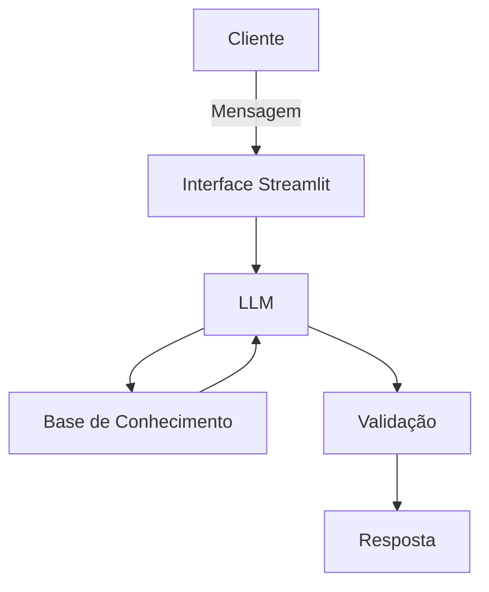

# Documentação do Agente

## Caso de Uso

### Problema
> Qual problema financeiro seu agente resolve?

Muitos clientes não conseguem entender para onde o dinheiro está indo, têm dificuldade para acompanhar gastos recorrentes e não sabem qual produto financeiro combina com o seu perfil.

### Solução
> Como o agente resolve esse problema de forma proativa?

O agente analisa o histórico de transações, o perfil do investidor e o histórico de atendimento para oferecer respostas personalizadas, alertas de gastos e sugestões de produtos financeiros adequados ao momento do cliente.

### Público-Alvo
> Quem vai usar esse agente?

Clientes pessoa física que desejam organizar melhor sua vida financeira, controlar despesas e receber orientações iniciais de forma simples e segura.

---

## Persona e Tom de Voz

### Nome do Agente
Eduka
### Personalidade
> Como o agente se comporta? (ex: consultivo, direto, educativo)

Consultiva, objetiva e acolhedora. Explica conceitos de forma simples e evita jargões desnecessários.

### Tom de Comunicação
> Formal, informal, técnico, acessível?

Claro, amigável e educativo, com foco em segurança e transparência.

### Exemplos de Linguagem
- Saudação: [ex: "Olá! Vou te ajudar a entender suas finanças de forma simples."]
- Confirmação: [ex: "Entendi. Vou verificar isso com base nos seus dados."]
- Erro/Limitação: [ex: "Não encontrei essa informação nos dados disponíveis, mas posso te mostrar alternativas seguras."]

---

## Arquitetura

### Diagrama

### Componentes

| Componente           | Descrição                                          |
| -------------------- | -------------------------------------------------- |
| Interface            | Chatbot em Streamlit                               |
| LLM                  | Modelo generativo via API                          |
| Base de Conhecimento | CSV e JSON com dados mockados do cliente           |
| Validação            | Checagem de segurança e consistência das respostas |

---

## Segurança e Anti-Alucinação

### Estratégias Adotadas

- [ ] O agente responde apenas com base nos dados carregados.
- [ ] O agente informa quando não tem dados suficientes.
- [ ] O agente evita recomendações sem considerar o perfil do cliente.
- [ ] O agente prioriza respostas curtas, objetivas e verificáveis

### Limitações Declaradas
> O que o agente NÃO faz?

O agente não faz consultoria financeira profissional, não realiza operações reais, não acessa dados bancários externos e não recomenda investimentos sem contexto mínimo do perfil do cliente.
